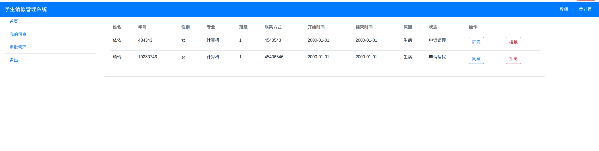
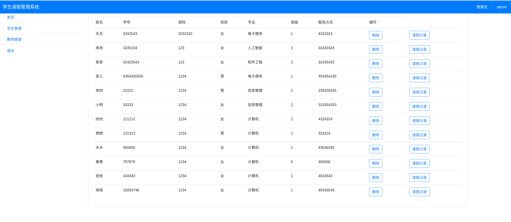

# 学生请假管理系统

## 一、项目设计部分

### 1.项目总体构成

项目使用nodejs+express+mongodb开发，实现了学生请假管理功能。

学生可以在系统中申请请假，教师会收到请假申请并进行审批，最后结果返回给学生。同时，管理员可以对所有用户进行管理，包括删除用户和修改学生请假信息 。

### 2.引入的包

（1）express  ：构建web服务器

（2）bootstrap-4.4.1-dist ：美化页面

（3）ejs :渲染页面

（4）mongoose:通过nodejs来操作mongodb数据库

（5）body-parser：获取前端传送过来的数据

（6）connect-multiparty：获取前端传送过来的数据

（7）silly-datetime ：获取当前时间

（8）express-session：在页面之间传递数据

### 3.项目目录结构

StudentLeave
├─README.md
├─app.js
├─package-lock.json
├─package.json
├─views
├─node_modules
├─modules
├─doc

README.md:说明文档

app.js：程序入口，包含了核心代码

package-lock.json：node_modules目录下所有模块的具体来源和版本号

package.json：项目所依赖模块的版本信息

views： 所有ejs页面

views
├─a_index.ejs
├─a_leave.ejs
├─a_list.ejs
├─a_login.ejs
├─a_student.ejs
├─a_teacher.ejs
├─a_top.ejs
├─link.ejs
├─s_apply.ejs
├─s_index.ejs
├─s_info.ejs
├─s_leave.ejs
├─s_list.ejs
├─s_login.ejs
├─s_reg.ejs
├─s_top.ejs
├─t_approve.ejs
├─t_index.ejs
├─t_info.ejs
├─t_list.ejs
├─t_login.ejs
├─t_reg.ejs
└t_top.ejs

node_modules：存放导入的模块

modules：封装了数据库的相关操作

modules
├─db.js
├─leave.js
├─service.js
└user.js

doc：存放图片

## 二、使用说明书

1.学生注册：学生填入相关信息并点击注册按钮，完成注册

学生登录：学生完成注册后，填入学号和 密码，完成登录

学生查看个人信息：点击左侧 我的信息 ，可查看个人信息

学生提交请假申请：点击左侧 申请请假 ，可提交请假申请

学生查看请假记录：点击左侧 我的请假记录，可查看个人的请假记录

教师注册：教师填入相关信息，点击注册按钮，完成注册

教师登录： 教师填入账号和密码，完成登录

教师查看个人信息： 点击左侧 我的信息，可查看个人信息

教师审批学生请假申请：点击左侧审批管理 ，教师可审批同专业学生的请假申请，可点击 同意 或 拒绝

管理员登录：管理员 账号：admin 密码：123 ，完成登录

管理员查看学生信息和用户请假申请 ：点击左侧 学生管理，可查看学生的信息，点击 删除，可删除这个用户，点击 请假记录，可 查看这个学生所有的请假记录， 其中可点击 删除 来删除这条记录，并且可以点击后面三个按钮来改变该记录的状态 

管理员查看教师信息： 点击左侧 教师管理，可查看教师的信息，点击 删除 可删除这个用户

所有页面左侧有 退出，点击后即退出登录

### 三、开发日记

###### 2021.12.28

完成了学生注册、登录、提交请假申请功能

###### 2021.12.29

完成了教师注册、登录、审批的功能

###### 2021.12.29

完成了管理员删除用户，修改请假申请状态

###### 2021.12.29

实现了用户查看个人信息的页面，修复了一些bug

###### 2021.12.30

修改了部分页面，更新了文档

